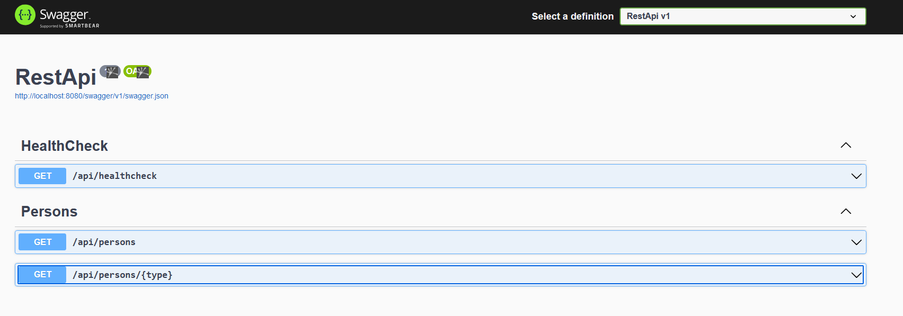

# Showcasing some C# Reflection Capabilities

This application purpouse is to showcase some *Reflection* and *Attributes* capabilities coming from c# and .NET.

## What we want to achieve

We neet to give to some customer the ability to just implement an Interface and our package will extend the API (developed from the customer itself) with some controllers that are able to get the *Extensions* developed from the customer and execute hangfire jobs based on some annotations given to the implementation.

# How it work

The package with the Reflection logic is the [Reflection](./app/Reflection/) project included in the [Reflection](./app/Reflection.sln) solution.

In the project there are some folders:
1. [Attributes](./app/Reflection/Attributes/): Where the attribute is implemented (In this case is PersonInfo which)
1. [Base](./app/Reflection/Base/): Where the Interface to be implemented is located 
1. [Enum](./app/Reflection/Enum)/: Where the types for the attributes are loated
1. [Reflect](./app/Reflection/Reflect/): Where the logic for reflection is implemented
1. [Services](./app/Reflection/Services/): Where the logic for the app is exposed to the customer. It should work as a bridge for the main application business logic

The [RestApi](./app/RestApi/) project needs to be implemented by the customer and it must have the Reflection project as dependency.

The customer need to implement the IPerson interface (see [Extension](./app/RestApi/Extensions/) folder) and register the services in the dotnet application and configure the app to use hangfire dashboard (if needed).

This will automatically add some rest endpoint that can use the Extension package.

## Test it

You will need docker and docker compose extension installed.

Run the app with `docker compose up --build` (optionally add `--watch` flag to see live changes in the app).

Visit [localhost:8080](http://localhost:8080/swagger/index.html) to see the available endpoints:


Now we have to focus in `api/person/{type}` endpoint, which is responsible to run hangfire jobs using the reflected classes.

Try executing the api with Human or Elf string as parameter, you should receive a response like in the image:


And looking to the Hangfire live dashboard 2 jobs are executed:


Try now adding a new class in App/RestApi/Extension folder. Here an example:

```
using Reflection.Base;

namespace App.Extension;

public class Example : IPerson
{
    public string Greet()
    {
        return "Hey from example";
    }
}
```

If you launched the app with --watch flag, it should automatically rebuild the app. If not just top the app and rerun `docker compose up --build`. Try to call the api and see the magic. Now 3 jobs are launched.